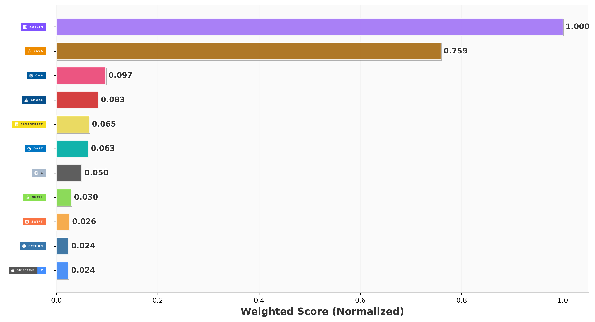

# E aí, sou Eric Bortoleto 👋

### Android Developer | Software Engineering Student

Sou um Engenheiro de Software brasileiro.  
I'm a Software Engineering student from Brazil.

Eu tenho experiencia profissional desenvolvendo aplicações para Android nativo **Java** and **Kotlin**, prestando suporte técnico a outros desenvolvedores, integrando soluções de pagamento Smart POS/TEF e dando manutenção a bibliotecas Android.  
I have professional experience developing native Android applications with **Java** and **Kotlin**, providing technical support for developers, integrating payment solutions (Smart POS/TEF), and maintaining Android libraries.

Atualmente estou expandindo meus conhecimentos com **Spring Boot, estudando **JPA, APIs REST, JWT, OAuth2, Docker e AWS**, ao mesmo tempo que me mantenho desenvolvendo meus conhecimentos no mundo Android com **Jetpack Compose, **MVVM** e arquiteturas modernas.  
Currently, I'm expanding my backend skills through **Spring Boot**, studying **JPA, REST APIs, JWT, OAuth2, Docker, and AWS**, while continuously improving my Android development knowledge with **Jetpack Compose**, **MVVM**, and modern architecture.

Estou em busca de novos desafios e oportunidades de construir aplicações eficientes e escalaveis.  
Always looking for new challenges and opportunities to build scalable and efficient applications.

---

## 🚀 Stack

### Mobile

### Backend

### Database

### Tools

---

## 🌎 Se conecte comigo

---

## 💼 Experiencia Profissional

📱 **Android Developer**
- Native Android (Java & Kotlin)
- Jetpack Compose, Room, Retrofit, Coroutines
- Smart POS Integrations
- Technical Support for Developers

☕ **Backend**
- Spring Boot
- REST APIs
- Maven Library publishes
- Library abstraction
- Pascal Library port to Android

---

## 📚 Atualmente aprendendo

- Spring Boot Expert
- Clean Architecture
- Microservices
- Docker
- AWS
- Advanced Security with Spring Security

